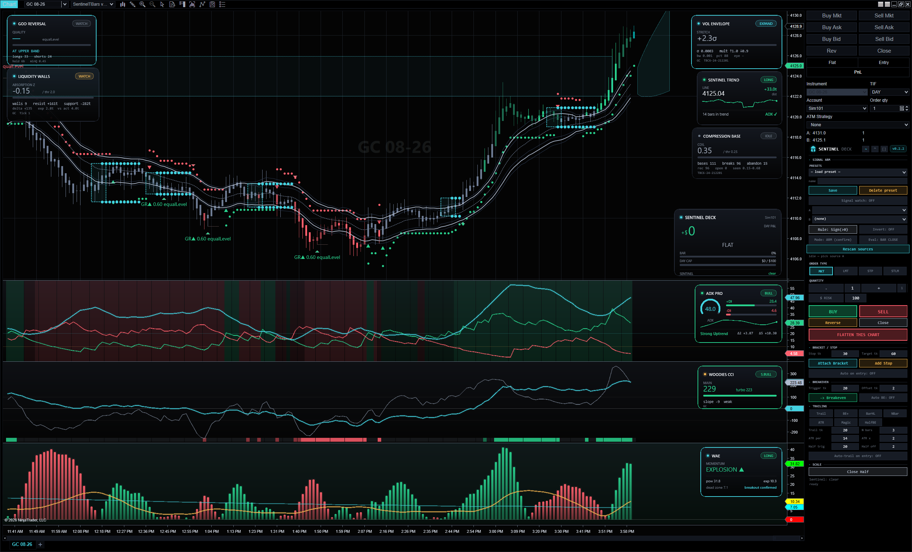
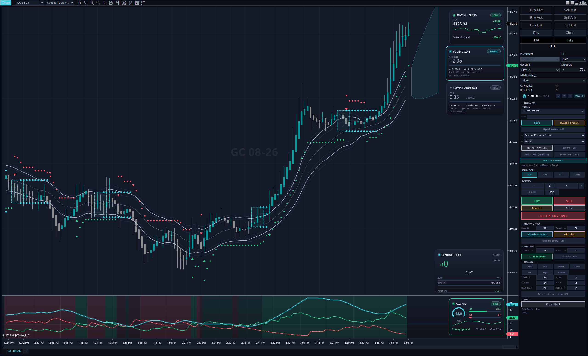
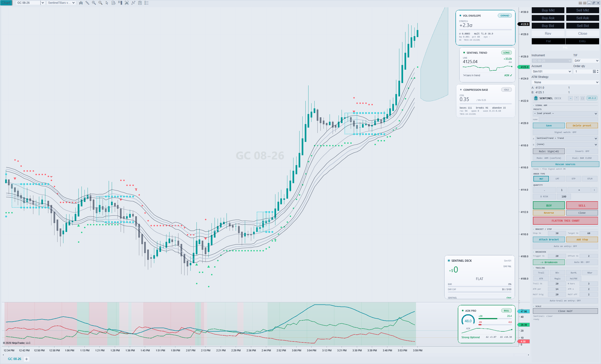
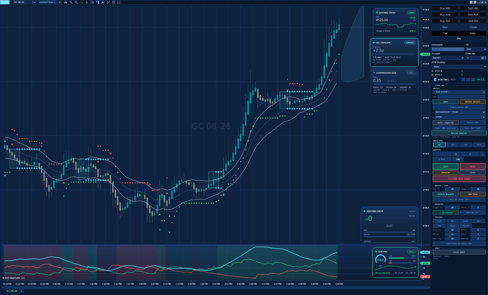
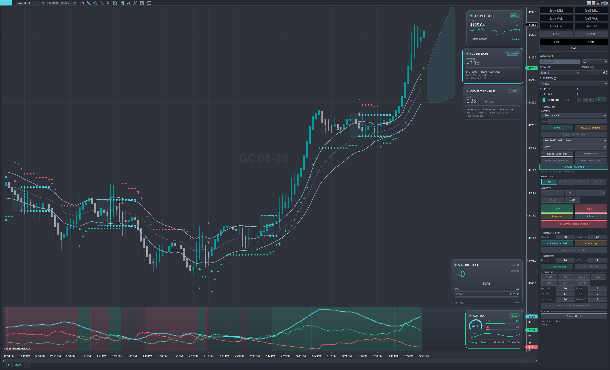
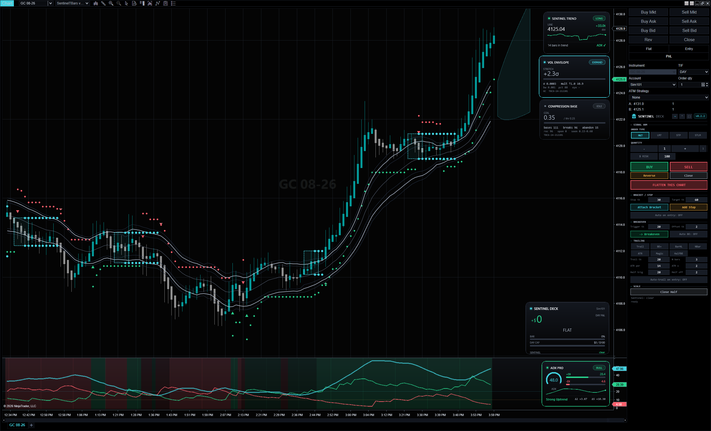
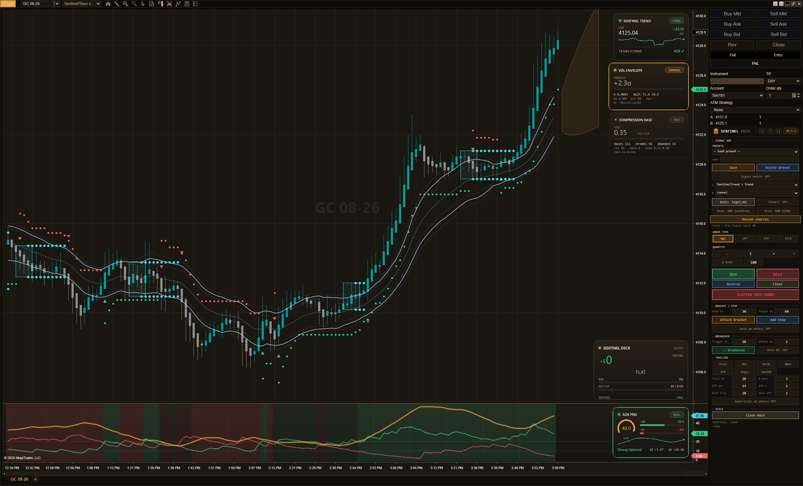

<div align="center">

# 🛡️ Sentinel Suite

### Make any chart beautiful. Then make it think.

Open-source instruments for **NinjaTrader 8** — a design system that reskins your whole platform,
and a family of sensors that read the tape. Free, forever, and yours to extend.


**[Live site »](https://silentsudo-io.github.io/sentinel-suite/)** · [Documentation](docs/) · [The Ladder](#the-ladder)



</div>

---

## Why Sentinel

Sentinel spans two ideas, kept deliberately separate so you can take either one on its own:

- **Beauty** — a flight-deck design system that makes *any* NinjaTrader chart look considered: glass
  HUD cards, seven cohesive themes, a theme-aware wallpaper. Flip one switch and the whole platform
  re-colors — charts, panels, chrome. Needs zero intelligence.
- **Intelligence** — a family of sensors (trend, momentum, regime, compression, liquidity, order-flow)
  that each stand alone as a clean, readable indicator and publish a state seam other tools can consult.
  Works on a plain chart. Needs zero skin.

One rule runs through all of it: **cyan means *live and watching*** — it's the only accent. Green and
red are reserved for **money and direction**, nothing else. Once you see it, you can't unsee it.

---

## What's inside

Three bundles, each self-contained. Install what you want; ignore the rest.

| Bundle | Rung | What you get |
|---|---|---|
| **🎨 [Sentinel Skins](src/skins/)** | 0 · Beauty | 7 platform themes (Dark · Light · Silver · Obsidian · Blueprint · Amber · Neon) · the `SentinelSkin` drawing framework (glass cards + auto-layout) · a theme-aware chart wallpaper |
| **📡 [Sentinel Sensors](src/sensors/)** | 1 · Intelligence | **8 hero signals** (Trend, ADX, Woodies CCI, VolEnvelope, Compression, Liquidity Walls, God Reversal, WAE) · 13 more (SuperTrend, Regime, Structure, VIDYA, Parabolic SAR…) · **3 bar types** (TBars, TbarsCount, **Flux** — order-flow imbalance) |
| **〰️ [Sentinel Smoothers](src/smoothers/)** | 1 · Beauty × Data | 23 moving averages & filters, clean-room and rebuilt to the suite's card/color language — EMA · HMA · DEMA · TEMA · VWMA · Zero-Lag family · Ehlers · Gaussian · Butterworth · Super Smoother |

Every tool is naming-law compliant, draws a glass card, and — where it's a signal — publishes a
`…State` seam. See **[docs/](docs/)** for the full reference.

---

## Seven themes. One switch.

| | | |
|:--:|:--:|:--:|
| <br>**Dark** | <br>**Light** | <br>**Blueprint** |
| <br>**Silver** | <br>**Obsidian** | <br>**Amber** |

None are inverted from another — each is designed on its own ground.

---

## Install

No package manager, no build step. NinjaScript source drops straight into the platform. You bring
NinjaTrader 8 — we ship no NinjaTrader binaries.

```bash
# 1 · get the source
git clone https://github.com/silentsudo-io/sentinel-suite

# 2 · copy the bundle(s) you want into NinjaTrader's Custom tree, e.g.
#     Documents\NinjaTrader 8\bin\Custom\
#     (src/runtime/ is shared — copy it once alongside any bundle)

# 3 · in the NinjaScript Editor, press F5 to compile
```

Then right-click a chart → **Skins**, **Indicators**, or **Bar Types** → look for **Sentinel**.
Full steps in the **[docs](docs/)**.

---

## The Ladder

Sentinel is built as a ladder — every rung stands alone *and* unlocks the next. **Rungs 0–1 are
released here.** The rest are built and under active development; the docs map the whole thing so you
can see where it goes.

| | Rung | | | Rung |
|--:|:--|---|--:|:--|
| **0** | Skins ✅ | | **6** | Prop-Survival Kit |
| **1** | Sensors & Smoothers ✅ | | **7** | The Bridge |
| **2** | Recorder & Log | | **8** | The Copier |
| **3** | Observatory | | **9** | Helm |
| **4** | The Council | | **10** | The ML Lab |
| **5** | Deck & Cockpit | | | |

---

## Documentation

The full canon lives in **[docs/](docs/)** — the design system, the naming law, the field manual, the
dataset dictionary, and a spec for every tool.

## Contributing

Sentinel is a *platform*, not just a suite — the naming law + state-seam protocol let anyone add a
compliant tool. See **[CONTRIBUTING.md](CONTRIBUTING.md)**.

## License & credits

Released under the **[Mozilla Public License 2.0](LICENSE)** — weak, file-level copyleft. The
**SENTINEL** name is a retained trademark; open-sourcing the code doesn't give away the brand.

- Helmet brand mark: *"barbute"* by **Lorc**, [game-icons.net](https://game-icons.net) — CC BY 3.0.
- `LiquidityWalls`: © **TradingIQ**, MPL-2.0.
- `StochasticTripleFilter`: ported from **AlgoTrade_Pro** (MPL-2.0); Gaussian channel © **DonovanWall**.

Full attributions in **[NOTICE](NOTICE)**.

## Disclaimer

Sentinel is for **education and research**. It is **not financial advice**, carries **no warranty**,
and nothing here is a recommendation to trade. Markets carry risk; you are responsible for your own
decisions.

---

<div align="center"><sub>🛡️ Sentinel Suite · built for traders who measure.</sub></div>
