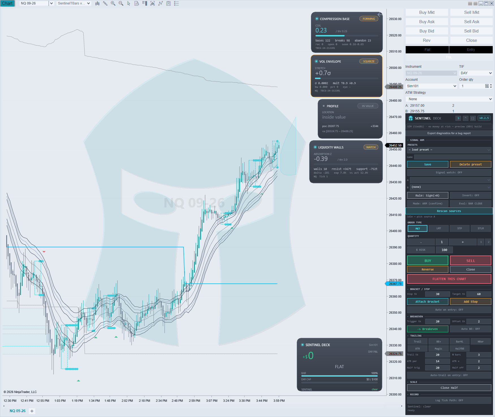

# Sentinel Deck — Tester's Guide

**Build:** `Sentinel Deck v0.2.5 (DEV)` · preview, for testing · **Date:** 2026-07-21
**You are testing:** a manual order deck that places **real orders**. Read §0 before you click anything.

Thank you for doing this. What we need from you is not praise — it is **the thing that went wrong**, with enough
detail that we can fix it without a dozen follow-up questions. §11 shows you how to give us that in one click.

---

## 0. Read this first

**This build has no simulation lock.** It will place orders on whatever account is selected in Chart Trader,
including a funded or evaluation account. That is deliberate: the Deck is built on the principle that *a human must
always be able to act, especially to exit*, so it warns you rather than stopping you.

**Start on SIM.** Everything in this guide can be tested on a simulation account. Move to a live or evaluation
account only after the mechanics feel right in your hands.

**The band under the header tells you what you are pointed at.** Check it before every session:

| band | meaning |
|---|---|
| `SIM (name) · no money at risk` — grey | a NinjaTrader simulation or playback account |
| `SIM (name) · auto-fire armed` — amber | simulation, but the deck can now submit by itself |
| `⚠ name — REAL orders (prop eval or funded)` — amber | **orders here are real**; a prop eval still costs a fee, a reset, or the account |
| `⚠ name · AUTO-FIRE ARMED — places REAL orders unattended` — **red** | the deck can trade a real account without you touching it |

If the band ever names an account you did not select, **stop and report it** — that is the most serious class of bug
in this build.

**Auto-fire is the headline feature under test and it has never been validated live.** It is enabled on purpose:
your runs are how it earns a green light. Treat it as unproven.

---

## 1. Setup

1. Open a chart, and **open Chart Trader** (the Deck reads the account and instrument from its selectors — without
   it the Deck cannot trade, and the diagnostics file will say `chart trader: NOT FOUND`).
2. Add the indicator: **Indicators ▸ Sentinel ▸ Sentinel Deck v0.2.5 (DEV)**.
3. Confirm the header chip reads **v0.2.5** and the band appears beneath it.
4. Select a **simulation account** in Chart Trader.



*A loaded Deck in context: the panel (right), its account risk card (centre), live order lines, and sensor cards
from the wider suite. You do not need any of the sensors to test the Deck — they are shown only so you can tell
the Deck's own surfaces apart from everything else on a busy chart.*

---

## 2. How to test anything in this guide

For each control: **do the action, then ask "did the chart, the account, and the panel all agree?"** Most real bugs
are a disagreement between those three — the panel says one thing, the account holds another.

Report anything where they disagree, anything that throws, and anything that surprised you even if it "worked".

> Going deeper: **[SENTINEL_DECK_SIM_TESTPLAN.md](SENTINEL_DECK_SIM_TESTPLAN.md)** is our internal
> feature-by-feature checklist (tick/$ math, all 7 trailing modes). Written against v0.2.0 and not yet re-verified,
> but useful if you want to be exhaustive. How and why the Deck is built the way it is:
> **[SENTINEL_DECK_SPEC.md](SENTINEL_DECK_SPEC.md)**.

---

## 3. Header — theme, pin, pop-out

| control | what it does | what to look for |
|---|---|---|
| `S` | cycles 7 themes (auto → dark → light → silver → obsidian → blueprint → amber) | every panel element re-colours; nothing goes invisible; the risk card follows |
| `^` | pins the floating panel on top | stays above other windows |
| `[]` | pops the panel out to its own window / docks it back | controls keep working in both states |

**Report:** any theme where text becomes unreadable or a control disappears. Say **which theme**.

---

## 4. Entry — order type, quantity, risk

| control | what it does | what to look for |
|---|---|---|
| `MKT` `LMT` `STP` `STLM` | chooses order type | the working-price controls appear/disappear appropriately |
| `−` / `+` / `1 2 5 10` | sets quantity | the number in the box matches what actually gets submitted |
| `$ RISK` + amount | sizes the position from your **stop distance** instead of a fixed quantity | with a 30-tick stop and $100 risk, the computed size should make sense for the instrument; a "&lt;1 lot" message means the risk is too small for one contract |
| `BUY` / `SELL` | submits | order appears in Chart Trader/Orders **and** the risk card updates |

**Watch for:** a quantity in the box that differs from the quantity that reaches the account. **Report immediately**
— that is a serious bug.

---

## 5. Exits — Close, Reverse, Flatten, Close Half

| control | what it does | what to look for |
|---|---|---|
| `Close` | closes the position on this chart's instrument | goes flat; no leftover working orders |
| `Reverse` | closes and flips to the opposite side | ends at the same size, opposite direction |
| `Close Half` | scales out half | remaining size is what you expect on an odd quantity (e.g. 3 → 1 or 2 — tell us which you got) |
| **`FLATTEN THIS CHART`** | closes the position **and** cancels working orders for this chart's instrument on the selected account | **only this instrument** is affected — other positions on the same account must be untouched |

**Test FLATTEN deliberately:** open positions in *two* instruments on one sim account, then flatten from one chart.
The other must survive. This is the control people reach for in a panic, so it must be exactly right.

---

## 6. Bracket, breakeven, trailing

| control | what it does | what to look for |
|---|---|---|
| `Stop tk` / `Target tk` | bracket distances in ticks | the lines land where the tick count says |
| `Attach Bracket` / `Add Stop` | attaches protection to an open position | orders actually appear at the account |
| `Auto on entry` | attaches protection automatically on a new entry | fires on the *next* entry, not retroactively |
| `-> Breakeven` / `Auto BE` | moves the stop to entry + offset once the trigger distance is reached | it should **ratchet** — never move backwards |
| `Trail` `BE+` `BarHL` `NBar` `ATR` `Magic` `HalfBE` | trailing modes, one active at a time | the stop follows price in the direction of the trade and **never loosens** |
| `Auto-trail on entry` | starts trailing automatically | |

**The single most valuable thing you can report here:** a stop that moved **the wrong way**, i.e. away from
protection. Include the trail mode and the parameters — the diagnostics file captures them for you.

Note: a stop that *appears* not to be trailing is often the ratchet correctly holding a tighter lock. The `Deck:trail`
log line (in your diagnostics export) shows the computed candidate versus the current lock, so we can tell which.

---

## 7. On-chart order lines

| action | what to look for |
|---|---|
| **drag** a stop or target line | the order re-prices to where you dropped it; the pill follows |
| **click** the chart with a working order type selected | sets the working price |
| **hover** a loaded indicator's plot while dragging | the line offers to attach to that plot |
| `Order lines ALWAYS ON TOP` | lines render above other indicators' cards instead of hiding behind them |

⚠ **Known issue — drag-to-attach snap.** Grabbing works; the *snap* to an indicator plot can fail. You do not need
to report this one unless it behaves differently from "the grab works but it doesn't stick".

**Do report:** dragging that grabs the wrong line, or an offset between the mouse and the line — especially at
**display scaling above 100%**. Tell us your Windows scaling percentage (the diagnostics file records it).

---

## 8. SIGNAL ARM — the feature we most need tested

This reads **any loaded indicator's plot** as a signal. There are no hardcoded signals: you pick the source.

1. Load an indicator that plots something directional.
2. Open `SIGNAL ARM` (top of the panel, collapsed by default).
3. `Rescan sources`, then pick **Source A** from the dropdown.
4. Choose a `Rule` — `Sign(>0)`, `Rising`, `A × B` cross, or `Threshold` — and `Invert` if needed.
5. Choose `Eval:` cadence — **bar close** (recommended) or every tick.
6. Choose the mode:
   - **`Mode: ARM (confirm)`** — highlights the primed BUY or SELL and waits for **you**. Start here.
   - **`Mode: AUTO-FIRE`** — submits by itself. **SIM first.**
7. Turn on `Signal watch`.

**What to look for**

- The status line reads `watching · A=<value> · <DIR>`. If it says `A=n/a`, the source did not resolve — **report
  that with the diagnostics file**, which lists every indicator on your chart and its plots.
- Signals fire on the bar **after** the source turns. That is intentional and non-repainting, not lag.
- Auto-fire is **one shot per bar**, **flat-only plus reverse**, and always a **market** order.
- If the Gate blocks an auto-fire you will see `auto-fire BLOCKED: <reason>` — **that is the system working.**
  Report it anyway, with the reason, so we can confirm the block was correct.

**Please report:** any auto-fire that fired when it should not have, did *not* fire when it should have, fired twice
on one bar, or fired while you were already positioned in that direction. These are the exact cases that decide
whether auto-fire ships.

**Note:** `Signal watch` deliberately does **not** survive a chart reload or F5. Automation should never silently
re-arm itself. If you ever find it re-armed on its own, that is a serious bug.

---

## 9. Record — Log Tick Path

`Log Tick Path` passively records the tick-by-tick path of your manual trades to
`Sentinel\Excursions\ticks\`. It **never touches your orders**. It is off by default; turn it on if you are willing
to share path data. Look for: files appearing after you go flat, and no change whatsoever in order behaviour.

---

## 10. The risk card

The on-chart card shows account, day P&L, position, unrealised P&L, open risk and a bar timer. Check it **agrees
with Chart Trader** at all times. A card that disagrees with the account is worth reporting even if trading is fine.

---

## 11. How to report a bug

**Click `Export diagnostics for a bug report` — do it as soon as the problem happens, before changing settings.**

**Windows Explorer opens automatically with the new file selected — you do not have to go looking for it.**

The file lands in your **NinjaTrader 8 user folder**, under `Sentinel\Support\`:

```
<your NinjaTrader 8 folder>\Sentinel\Support\deck-diag-<timestamp>.txt

typically:  C:\Users\<you>\Documents\NinjaTrader 8\Sentinel\Support\
```

> Not under `Documents`? NinjaTrader's user folder can be relocated, and OneDrive sometimes redirects `Documents`.
> Two reliable ways to find it: the Deck's status line prints the **full path** the moment you export, and
> NinjaTrader's **Control Center ▸ Help ▸ About** shows the folder it is using.

It contains your build version, account and its classification, every panel setting, the indicators loaded on your
chart, the Deck's log trail, and today's order ledger. Attach that file.

Then tell us, briefly:

1. **What you did** — the clicks, in order.
2. **What you expected.**
3. **What happened instead.**
4. **SIM or real?**

That is it. The file carries the rest.

> **Privacy:** the export contains your account *names*, instruments, order and fill history for the day, and your
> Deck settings. It contains no passwords or API keys. Read it before you send it — it is plain text.

---

## 12. What we are most looking for, in priority order

1. **Anything that moves money you did not intend** — wrong quantity, wrong side, wrong instrument, an exit that
   did not exit.
2. **Auto-fire behaving incorrectly** — fired when it shouldn't, didn't when it should, twice on a bar.
3. **A stop that moved the wrong way** under any trailing or breakeven mode.
4. **`FLATTEN THIS CHART` touching something it shouldn't.**
5. **The band naming the wrong account**, or reading SIM on a real account.
6. Everything else — layout, theme, ergonomics, wording, things that simply annoyed you.

Items 1–5 are why this preview exists. Item 6 is how it gets good.
